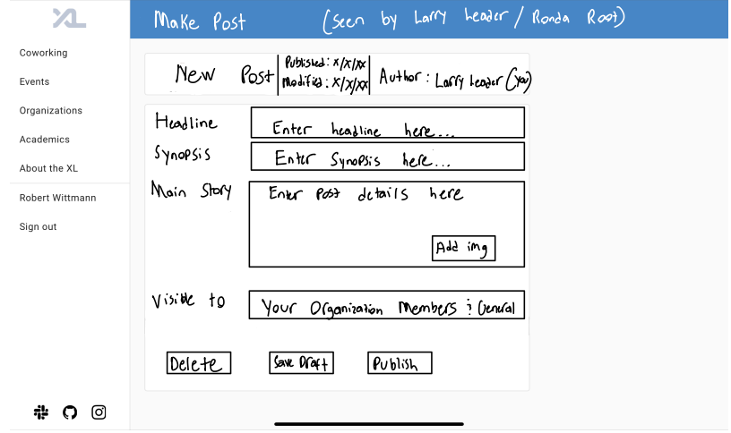
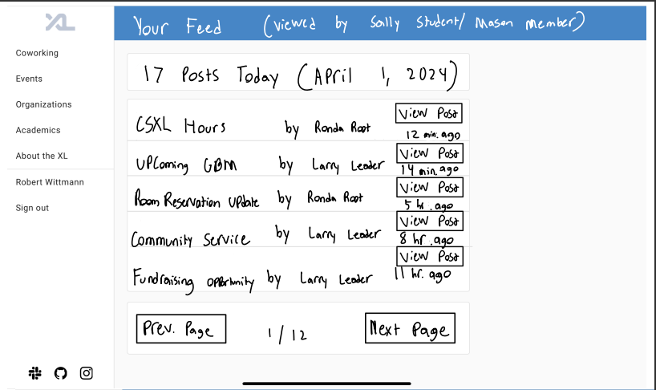
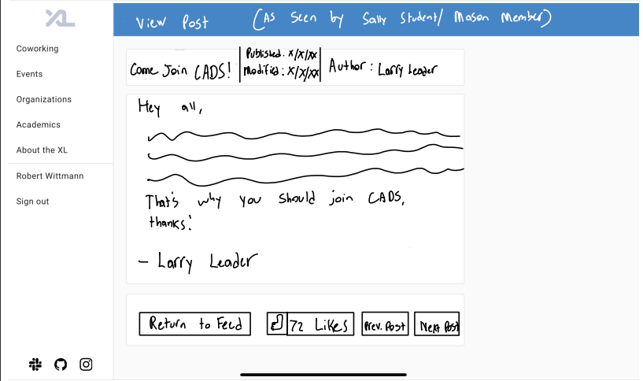
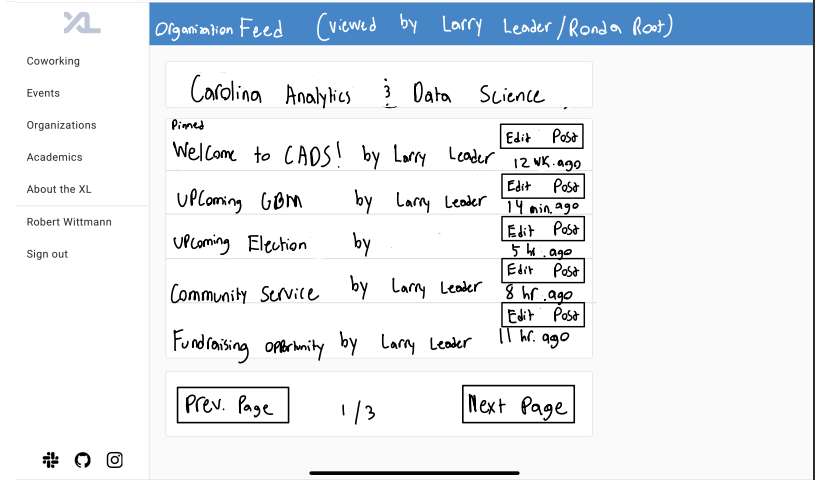

Design Doc

Team: F2
CSXL Updates and Newsboard

Anish Kompella, Aditya Krishna, Robert Wittmann

Overview: Restate the value and need of the feature in your team’s own words.
Allows general users to see exciting news updates, stories, and upcoming events for the CSXL and UNC Computer Science organizations. Acts as the new home page and allows fosters a sense of community within the Computer Science department as students are able to see relevant information within organizations which they participate in or other news that interests them. 

Key Personas: Describe the key personas your feature serves. What are their needs and goals with your feature?

Larry Leader: As Larry Leader, I want to be able to post news and announcements so that members of my organization can view and get information from them. During organization recruitment times I can post to the website so that users not in my organization can see my feed.
Sally Student: As Sally student, I want to be able to view all of the CSXL posts so that I can stay up to date with all that's happening in the CSXL.
Rhonda Root: As Rhonda Root, I want to be able to post news stories and events as well to edit any post and delete them as neccessary so that I can keep CSXL users informed and modify/delete posts that do not meet the standards.
Mason Member: As Mason Member, I want to be able to view CSXL posts as well as the posts of organizations that I am in so that I can stay informed about CSXl events and organizations.

User Stories organized by persona, necessity for a minimum-viable feature, and frequency/importance of use.

As Larry Leader, I want to be able to create, edit, and delete drafts of announcments to members. 

As Sally Student, I should be able to view only the CSXl posts on the homepage.
As Sally Student, I should not be able to see organizations that I am not part of except during recruitment season. 

As Rhonda Root, I should view, post, edit, and delete any post on the CSXL page including organizations. I should be able to see all the existing drafts for an organization. I want to be able to see all the posts on each organization's page.

Wireframes / Mockups:

As seen in the wireframe images below, organization leaders can create/edit posts, and students, members, and other users can view these posts in their feed, as well as click on any post to see more details. Organizations have their own page as well, where leaders can see all of their posts in one place and edit them accordingly. 

Technical Implementation Opportunities and Planning

1. The existing backend user organization and permission functionalities will be extended and integrated in our project. We will use these to add metadata to our posts and ensure that the operations done by a user are correctly authorized using permissions.

2. We want to make a new home page, a post draft page, a modified organization page with their posts, and a user view of a post.

3. We will add a post entity and a post model. The frontend/backend model should be very similar if not the same so the services for both the frontend and backend and communicate properly. The PostEntity will have to leverage User and Organization entities as well.

4. We will need Crud operations for the all the posts. The authorization will be performed by the backend service, although we should ensure the frontend will not allow this to happen.

5. The newsfeed should only be able modified by Rhonda Root personas. The announcement feed should only be edited by that organizations administrator(s). Sally Student and Mason Member should not be able to edit or delete a post and only Mason Member should be able to view his subscribed to organizations posts.

